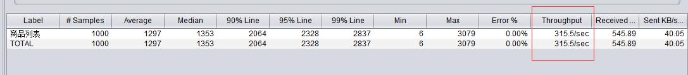

# 高性能高并发秒杀系统

### 压测工具使用jmeter

衡量网站并发承载能力：在具体的并发请求下，网站的QPS是多少

jmeter测试服务某个接口吞吐量

### CPU负载概念
cpu负载的定义：在一般情况下可以将单核心cpu的负载看成是一条单行的桥，数字1代表cpu刚好能够处理过来，即桥上能够顺利通过所有的车辆，桥外没有等待的车辆，桥是畅通的。当超过1时表示有等待上桥的车辆，小于1时表示车辆能够快速的通过。单核心cpu就表示该cpu能够处理的事务数是1。

在多核cpu中cpu能够并行处理的事务的数量应该是cpu个数*cpu核数，而且负载数最好不要超过这个数值。例如一个4核cpu，则cpu_load最大值为4，不能长期超过4，否则会有任务没有得到及时的处理,而使系统的负载累积增高，导致系统运行缓慢。

### 使用jmeter进行服务并发压测实际数据对比

#### 环境：

本地电脑配置：
CPU：Intel(R) Core(TM) i5-6200U CPU @ 2.30GHz 双核
内存：8GB
硬盘：SSD固态256GB

java服务： 跑在本地

mysql： 装在1核、1GB内存的虚拟机上

#### 压测数据

接口：http://localhost:8080/goods/to_list

1. 在1000的并发下，吞吐量为300/秒 左右，如下图

2. 在10000的并发下，吞吐量为100/秒 左右，如下图
